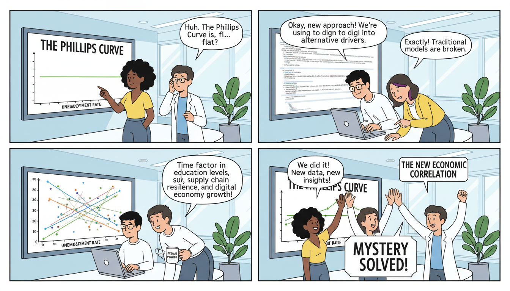

This is a professional and comprehensive `README.md` designed for your repository. It highlights the economic research, the technical implementation, and the key findings of your analysis.

---

# Data Analysis: Global Phillips Curves & Macroeconomic Drivers

[](https://www.python.org/)
[](https://jupyter.org/)
[](https://opensource.org/licenses/MIT)

## 📌 Project Overview

This repository provides an in-depth empirical analysis of the **Phillips Curve**—the historical inverse relationship between unemployment and inflation—across various global economies over the last 20 years.

While classical economic models suggest a clear trade-off between these two variables, modern data suggests this relationship has "flattened" or decoupled. This project explores that breakdown and extends the research into the structural components of unemployment (education-based), sectoral shifts, and GDP growth drivers using regression modeling.

## 🚀 Key Research Questions

1.  **The Phillips Curve Paradox:** Does the negative correlation between inflation and unemployment still hold in modern economies?
2.  **Structural Unemployment:** How does education level impact unemployment rates across different nations?
3.  **Sectoral Composition:** What are the dominant economic sectors per country and how do they shift?
4.  **GDP Growth Drivers:** Which components of GDP (Consumption, Investment, Government Spending, Net Exports) are the primary predictors of growth in high-performing economies?

## 🛠 Technologies Used

The analysis is performed entirely in Python, utilizing the standard data science stack:
*   **Pandas & NumPy:** For data manipulation and cleaning.
*   **Matplotlib & Seaborn:** For econometric visualization and trend analysis.
*   **Scikit-Learn:** For linear regression models and GDP component analysis.
*   **Statsmodels:** (Optional) For detailed statistical summaries of the Phillips Curve relationship.

## 📂 Repository Structure

*   `TRABAJO_LIBRERIAS_ALBERTOMARTINEZLASHERAS.ipynb`: The core Jupyter Notebook containing data ingestion, cleaning, exploratory data analysis (EDA), visualizations, and regression models.
*   `README.md`: Project documentation.

## 📊 Methodology

### 1. Phillips Curve Analysis
We extract 20 years of historical inflation and unemployment data. By plotting these variables, we calculate the correlation coefficient to determine if the "negative slope" still exists or if it has evolved into a horizontal trend.

### 2. Education & Human Capital
The analysis breaks down unemployment by educational attainment:
*   Primary Education or less
*   Secondary Education
*   Tertiary (Higher) Education

### 3. GDP Regression Model
We apply a Multi-variable Linear Regression model to evaluate the components of GDP:
$$GDP = C + I + G + (X - M)$$
The model identifies which variables provide the highest coefficients for specific countries, explaining why some nations experience faster growth than others.

## 💻 How to Use

### Prerequisites
Ensure you have a Python environment installed. You can install the necessary dependencies via pip:

```bash
pip install pandas numpy matplotlib seaborn scikit-learn jupyter
```

### Running the Analysis
1. Clone this repository:
   ```bash
   git clone https://github.com/your-username/data_analysis-philips-curves.git
   ```
2. Navigate to the directory:
   ```bash
   cd data_analysis-philips-curves
   ```
3. Launch the Jupyter Notebook:
   ```bash
   jupyter notebook TRABAJO_LIBRERIAS_ALBERTOMARTINEZLASHERAS.ipynb
   ```

## 📈 Sample Code Snippet

```python
import pandas as pd
import matplotlib.pyplot as plt
import seaborn as sns

# Quick visualization of the Phillips Curve for a specific country
def plot_phillips_curve(df, country_name):
    country_data = df[df['country'] == country_name]
    
    plt.figure(figsize=(10, 6))
    sns.regplot(x='unemployment_rate', y='inflation_rate', data=country_data, lowess=True)
    plt.title(f'Phillips Curve: {country_name} (Last 20 Years)')
    plt.xlabel('Unemployment Rate (%)')
    plt.ylabel('Inflation Rate (%)')
    plt.grid(True)
    plt.show()
```

## 📝 Findings & Conclusions

*   **Relationship Breakdown:** In the majority of analyzed countries, the Phillips Curve is no longer a reliable predictor of inflation based on unemployment levels.
*   **Education Gap:** There is a significant inverse correlation between education levels and unemployment duration, suggesting that human capital investment remains the strongest defense against economic downturns.
*   **GDP Variance:** Growth in emerging economies is heavily weighted toward Net Exports and Investment, whereas developed economies show a higher reliance on Domestic Consumption.

---

**Author:** Alberto Martínez Lasheras
**Contact:** [Your Email/LinkedIn]
**License:** This project is licensed under the MIT License.